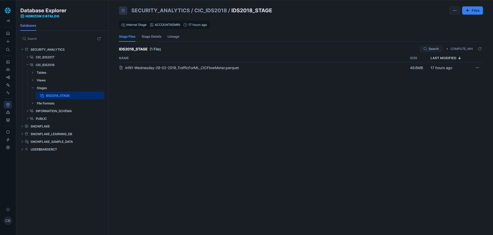
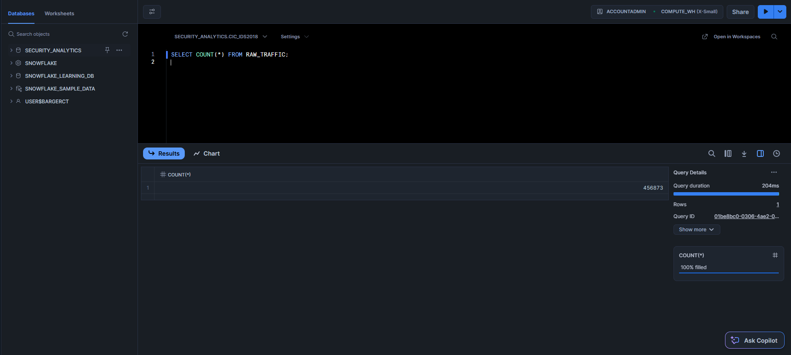
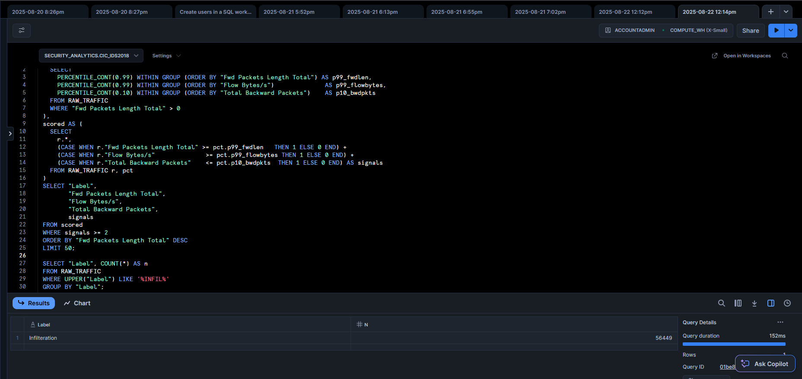
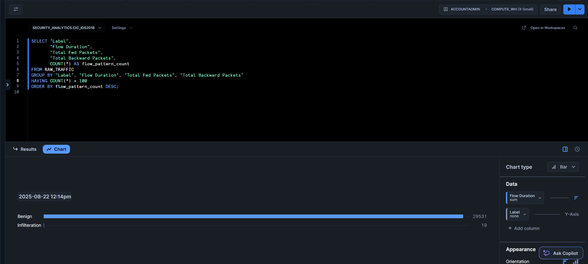
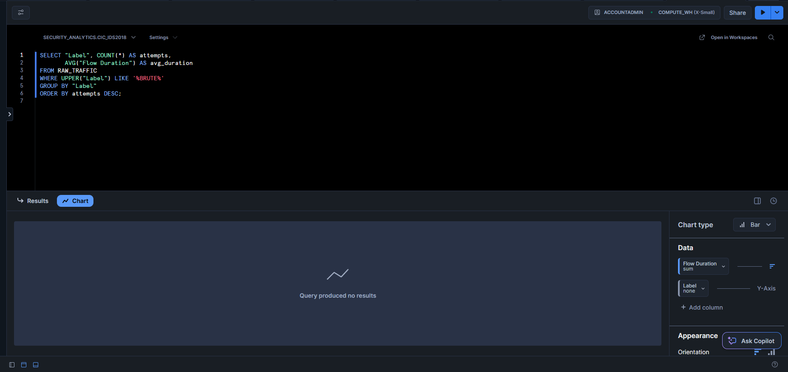

# Threat Hunting in Snowflake with CIC-IDS2018 (Wednesday Infiltration)

Cloud-based threat hunting using Snowflake as a security data lake.

**Findings**
- Infilteration (misspelled) ≈ 56k rows; exfil outliers confirmed
- Botnet repetitive/clustered flows present
- Brute force: none observed in this subset

## Repo Contents
- `queries/` – setup & hunts
- `docs/hunt_reports.md` – hypothesis → query → evidence → conclusion
- `images/` – screenshots 
- `data/README.md` – how to get the dataset 

## Quick Start (Snowflake)
1. Run `queries/00_setup_env.sql`
2. Upload Parquet/CSV to stage; run `queries/01_load_parquet_or_csv.sql`
3. Run hunts:
   - Exfiltration: `queries/10_hunt_infiltration_exfil.sql`
   - Botnet C2: `queries/20_hunt_botnet_c2.sql`
   - Brute Force: `queries/30_hunt_bruteforce.sql`

## Results

### Stage Upload
Shows the infiltration dataset staged in Snowflake.  

### Row Count & Labels
Row count confirms successful load, and `Infilteration` label is present.  
  

## Threat Hunts

### Hunt 1 — Infiltration / Exfiltration
Hypothesis: A compromised host sends unusually large outbound flows.  
Evidence: ~56,449 rows labeled `Infilteration`.  

### Hunt 2 — Botnet C2 Beaconing
Hypothesis: Multiple hosts beacon to the same external C2 server.  
Evidence: Highly repetitive flows under `Bot` label.  

### Hunt 3 — Brute Force
Hypothesis: Short repeated flows indicate credential brute-force.  
Evidence: None found in this subset.  

## MITRE ATT&CK Mapping
- Exfiltration → TA0010 (e.g., T1041)
- Command & Control → TA0011 (e.g., T1071)
- Credential Access (not seen here) → TA0006 (T1110)

## Notes
- CIC-IDS2018 often spells the label as `Infilteration`. Queries handle this.
- No large data stored in repo.
